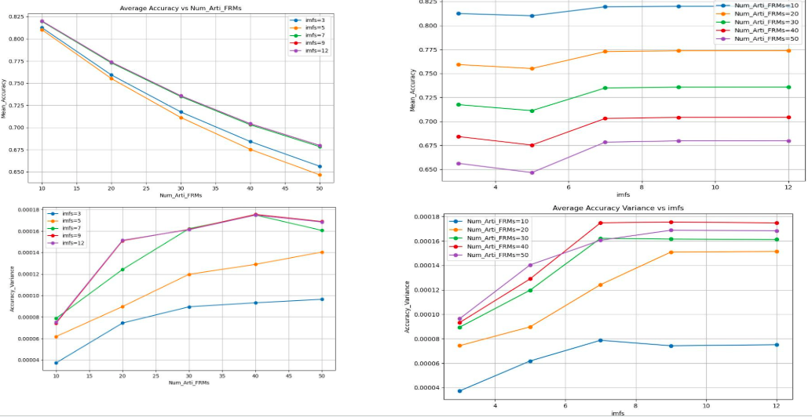
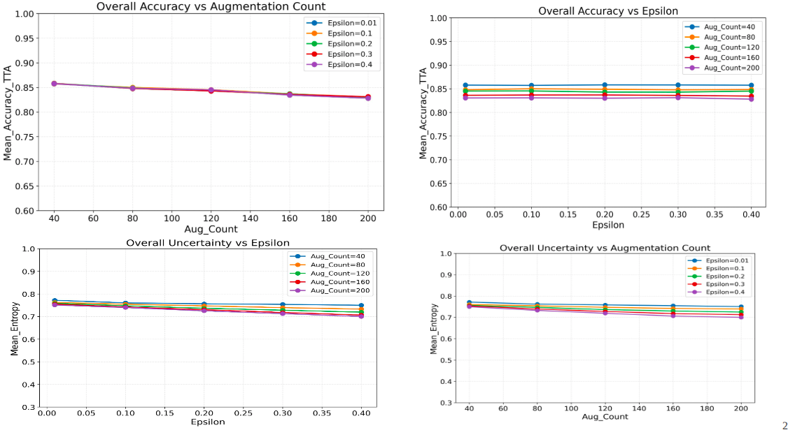

# EEG-based Motor Imagery Classification with Aleatoric Uncertainty Estimation

This project focuses on estimating **aleatoric uncertainty** in EEG-based motor imagery classification using the **BCI Competition IV 2a** dataset. We apply **Test-Time Data Augmentation (TTDA)** techniques to capture the uncertainty caused by inherent data noise and variability.

---

## 📌 Table of Contents

- [Dataset](#dataset)
- [Aleatoric Uncertainty Estimation](#aleatoric-uncertainty-estimation)
  - [1. EMD-TTA](#1-emd-tta-empirical-mode-decomposition)
  - [2. ICA + FGSM TTA](#2-ica--fgsm-based-tta)
- [Metrics Used](#metrics-used)
- [Preliminary Results](#preliminary-results)

---

## Dataset

### BCI Competition IV 2a

- **Subjects**: 9
- **Channels**: 22 EEG + 3 EOG
- **Sampling Rate**: 250 Hz
- **Tasks**: Left Hand, Right Hand, Feet, Tongue
- **Total Trials**: 576 per subject (288 train + 288 eval)
- **Trial Duration**: 7.5 seconds (motor imagery from 3s to 6s)

---

## Aleatoric Uncertainty Estimation

We explore **two methods** to model data-based uncertainty using TTDA.

---

### 1. EMD-TTA (Empirical Mode Decomposition)

We apply EMD on EEG trials to generate **artificial EEG frames** for Test-Time Data Augmentation.

- Each EEG trial is decomposed into **Intrinsic Mode Functions (IMFs)** using the PyEMD library.
- Selectively recombine subsets of IMFs to generate **new artificial EEG frames**.
- These frames simulate signal variations encountered in real data.

#### Experimental Setup:
- Number of Artificial Frames: 10, 20, 30, 40, 50
- IMFs used: 3, 5, 7, 9, 12
- Metrics: Mean Accuracy, Accuracy Variance, Mean Kappa, Kappa Variance

📊 _Plot: Accuracy vs Number of Frames (example)_  

---

### 2. ICA + FGSM-based TTA

We generate **adversarial yet physiological** EEG variations using Independent Component Analysis (ICA) and FGSM.

#### Method:

1. **ICA Decomposition**:
   - Decompose each trial into **22 independent components (ICs)** using FastICA.
   - Select relevant ICs based on:
     - Spectral power (7–13 Hz for hand; 12–32 Hz for feet/tongue)
     - Topographic relevance to motor cortex channels (C3, C4, Cz)

2. **FGSM Perturbation**:
   - Compute loss gradients on selected ICs.
   - Apply perturbations using FGSM scaled by `epsilon (ε)`.
   - Use bandpass filters to preserve physiologically plausible frequencies.
   - Add Gaussian noise for natural variation.

3. **Reconstruction**:
   - Inverse ICA used to reconstruct augmented EEG.
   - Combine predictions using **cosine similarity** across top-3 softmax vectors.

#### Experimental Setup:
- Epsilon values: 0.01, 0.1, 0.2, 0.3, 0.4
- Augmentations per class: 10, 20, 30, 40, 50
- Evaluation: 10 runs using ATCNet
- Metrics: Accuracy, Cohen’s Kappa, Entropy of Softmax

📊 _Plot: Accuracy vs Epsilon and Uncertainty vs Epsilon 

---

## Metrics Used

| Metric           | Description |
|------------------|-------------|
| **Mean Accuracy** | Average correct predictions across subjects |
| **Accuracy Variance** | Measures model performance variability across subjects |
| **Mean Kappa**   | Agreement between predicted and true labels |
| **Kappa Variance** | Reliability difference across subjects |
| **Entropy**      | Uncertainty in prediction probabilities |

---

